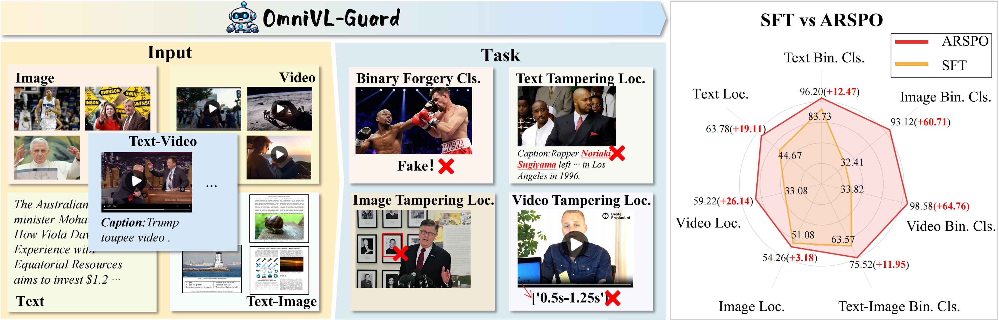
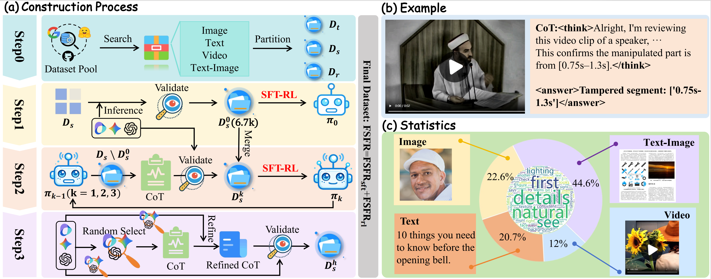

<div align="center">

# OmniVL-Guard: Towards Unified Vision-Language Forgery Detection and Grounding via Balanced RL

<a href="https://arxiv.org/abs/2602.10687"></a>
<a href="#"></a>
<a href="#"></a>
<a href="#"></a>

</div>

---

## 🎉 News

- [x] **[2026.04.30]** OmniVL-Guard has been accepted to **ICML 2026**!
- [ ] Release **OmniVL-Guard-8B**, our flagship unified vision-language forensic model.
- [ ] Release **FSFR (Full-Spectrum Forensic Reasoning)**, a large-scale multimodal forensic reasoning dataset.
- [ ] Open-source the complete **OmniVL-Guard code base**, including the full training pipeline from scratch.
- [ ] Release **OmniVL-Guard-3B**, a lightweight and efficient version for broader deployment.
- [ ] Provide fine-tuning recipes and checkpoints for adapting **OmniVL-Guard-8B / OmniVL-Guard-3B** to additional forensic datasets.

Please **Star** ⭐ this repository to stay updated!

---

## 🏆 Status: Accepted by ICML 2026

> **OmniVL-Guard** has been accepted by **ICML 2026**.
>
> The source code, model checkpoints, training pipeline, and the **FSFR (Full-Spectrum Forensic Reasoning)** dataset are currently being prepared for public release.
>
> We are committed to making this project fully reproducible and easy to extend for future research in multimodal forgery detection and grounding.

---

## 📖 Introduction

**OmniVL-Guard** is a unified framework designed to bridge the gap between multimodal forgery detection and fine-grained grounding.

It is the first framework capable of simultaneously handling forgery detection and grounding across dominant social media modalities — **Image, Text, and Video** — within a single paradigm.

### 🌟 Key Features

- **Unified Multi-Modal Defense:** Handles text, image, and video forgeries simultaneously.
- **Balanced Reinforcement Learning:** Introduces **ARSPO** — Adaptive Reward Scaling Policy Optimization — to address the “difficulty bias” in multi-task learning.
- **Reasoning-Driven Forensics:** Leverages **Self-Evolving CoT (Chain-of-Thought)** generation to synthesize high-quality forensic reasoning paths and overcome the cold-start challenge.
- **Fine-Grained Grounding:** Supports spatial localization for images, semantic localization for text, and temporal localization for videos.
- **State-of-the-Art Performance:** Achieves strong in-domain performance and robust zero-shot generalization on out-of-domain benchmarks.

---

## 🖼️ Framework Overview

<div align="center">
  
  <br>
  <em>Figure 1: The unified vision-language forgery detection and grounding framework, OmniVL-Guard. The right side illustrates how ARSPO achieves balanced optimization compared to standard SFT.</em>
</div>

<br>

---

## 🧠 Core Components

### 1. Self-Evolving CoT Generation

We propose a four-stage pipeline to generate high-quality forensic reasoning data:

1. **Source Data Collection** from diverse public datasets.
2. **Forensic Reasoning Seed Priming** using state-of-the-art MLLMs.
3. **Seed Bootstrapping** through self-evolution.
4. **Collaborative Hard-CoT Synthesis** for long-tail and difficult samples.

This pipeline enables OmniVL-Guard to learn not only whether content is forged, but also why and where the forgery occurs.

### 2. ARSPO: Adaptive Reward Scaling Policy Optimization

To address the imbalance where simple classification tasks can dominate gradients, we introduce **ARSPO**.

ARSPO dynamically modulates reward scales and task weights through:

- **Task-Based Reward Mapping Function:** Applies adaptive and non-linear rewards for harder grounding tasks.
- **Dynamic Coefficient Adjustment:** Balances optimization across classification and localization objectives.
- **Difficulty-Aware Learning:** Ensures that fine-grained localization tasks are effectively learned instead of being overwhelmed by easier binary classification signals.

<div align="center">
  
  <br>
  <em>Figure 2: The Self-Evolving Forensic CoT Generation pipeline and statistics for the resulting FSFR dataset.</em>
</div>

---

## 📊 Dataset: FSFR

We present **FSFR (Full-Spectrum Forensic Reasoning)**, a comprehensive multimodal corpus designed for the complete SFT-RL pipeline.

### Dataset Scale

- **~73K SFT samples** with Chain-of-Thought forensic reasoning.
- **~110K RL samples** for balanced reinforcement learning.

### Modalities

- **Text**
- **Image**
- **Video**

### Tasks

- **Binary Forgery Classification**
- **Tampering Localization**
  - Spatial localization for images
  - Semantic localization for text
  - Temporal localization for videos

> The download link and usage instructions for FSFR will be released soon.

---

## 📈 Performance

OmniVL-Guard significantly outperforms existing state-of-the-art MLLMs and domain-specific forensic methods.

Notably, it achieves substantial gains in challenging localization tasks.

| Method | Binary Cls. | Image Loc. (IoU) | Text Loc. (F1) | Video Loc. (tIoU) |
| :--- | :---: | :---: | :---: | :---: |
| **OmniVL-Guard (Ours)** | **96.20%** | **54.26%** | **63.78%** | **59.22%** |
| Improvement vs Best | +6.97% | +5.73% | +22.92% | +37.79% |

Please refer to our paper for full comparison tables and detailed experimental analysis.

---

## 🚀 Release Plan

- [ ] **OmniVL-Guard-8B**  
  Flagship unified vision-language forensic model.

- [ ] **OmniVL-Guard-3B**  
  Lightweight and efficient forensic model.

- [ ] **FSFR Dataset**  
  Full-Spectrum Forensic Reasoning dataset.

- [ ] **Full Code Base**  
  Complete training and evaluation pipeline from scratch.

- [ ] **Fine-Tuning Recipes**  
  Recipes for adapting OmniVL-Guard-8B / OmniVL-Guard-3B to other datasets.

- [ ] **Additional Fine-Tuned Checkpoints**  
  OmniVL-Guard variants fine-tuned on external forensic datasets.

---

## 🛠️ Usage

The full source code, model checkpoints, dataset, and training instructions are being prepared for release.

Once released, this repository will include:

- Environment setup instructions
- Data preparation scripts
- SFT training pipeline
- RL training pipeline with ARSPO
- Evaluation scripts for classification and localization
- Fine-tuning examples for new forensic datasets
- Model checkpoints for OmniVL-Guard-8B and OmniVL-Guard-3B

---

## 📝 Citation

If you find this work helpful, please consider citing our paper:

```bibtex
@article{shen2026omnivl,
  title={OmniVL-Guard: Towards Unified Vision-Language Forgery Detection and Grounding via Balanced RL},
  author={Shen, Jinjie and Wu, Jing and Wang, Yaxiong and Cheng, Lechao and Tang, Shengeng and Hui, Tianrui and Pu, Nan and Zhong, Zhun},
  journal={arXiv preprint arXiv:2602.10687},
  year={2026}
}
